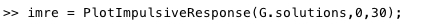

# Graph-Regularization
In this repository you will find the essentials Matlab scripts to simulating the algorithm proposed in the paper:

“On-line Learning On Temporal Manifolds” (Marco Maggini, Alessandro Rossi , 2016) 

## Functions

[TRgraph.m](https://github.com/alered87/Graph-Regularization/blob/master/TRgraph.m)
Is the main function in which we define the class containing all the variables and methods

[makeSystemMatrix.m](https://github.com/alered87/Graph-Regularization/blob/master/makeSystemMatrix.m) 
Computes the matrices defining the dynamical system, given the parameters (called by [TRgraph.m](https://github.com/alered87/Graph-Regularization/blob/master/TRgraph.m) at the initialization)

[PlotImpulsiveResponse.m](https://github.com/alered87/Graph-Regularization/blob/master/PlotImpulsiveResponse.m) 
Plots the Impulsive Response of the dynamical system, given the roots of the characteristic polynomial (just to visualize the impulsive response if needed)

[euclidean.m](https://github.com/alered87/Graph-Regularization/blob/master/euclidean.m) 
Computes the Euclidean distance pair-wise between the elements of two matrices (called by [TRgraph.m](https://github.com/alered87/Graph-Regularization/blob/master/TRgraph.m) to compute the Spatial Adjacency matrix weights)

## Data

MNISTtrainingSequence*.mat files containing (in order) a slice of the complete train sequence. Each files contains a matrix Data* collecting row-wise each sample (column 1 to 784) and its target (column 785 to 794). The complete sequence can be obtained by concatenating them:

MNISTtest.mat : its the original test set from MNIST [1], already extracted and processed so as to normalize features in [0,1]

[MNISTvideo.avi](https://github.com/alered87/Graph-Regularization/blob/master/MNISTvideo.avi)
Show a little slice (about 40 sec.) of the training sequence video

## Usage

After loaded the proposed dataset, or defined your own data in a matrix in the number_of_samples-by-(input_size+number_of_classes) form, you have to initialize the object by

all the argument of [TRgraph.m](https://github.com/alered87/Graph-Regularization/blob/master/TRgraph.m) are optionals and have to be called in argument-value pair; 'classes' declare the target dimension (default = 10). You can visualize the Impulsive Response generated by the parameters by:

The training can be started by 

requiring as argument data and the number of Epochs. Training can be restarted on different data of the same dimension, so its better start with 1 epochs and check performance on the matrix of test data of the same form:

>> [Accuracy,MSE] = G.test(testSet);

##Contacts: 
Alessandro Rossi : rossi111@unisi.it

[1] see: http://yann.lecun.com/exdb/mnist/
